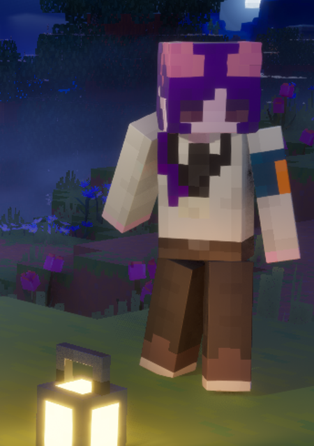
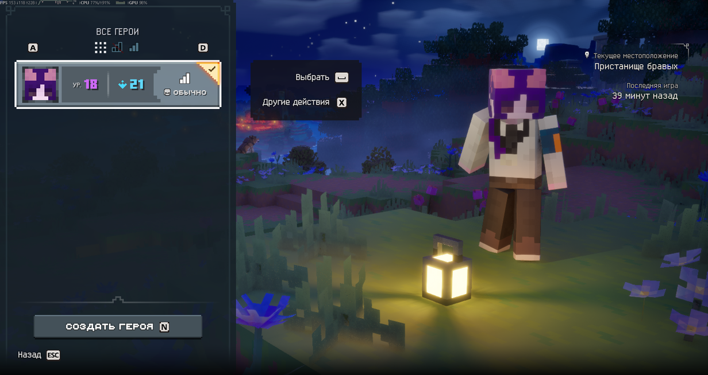
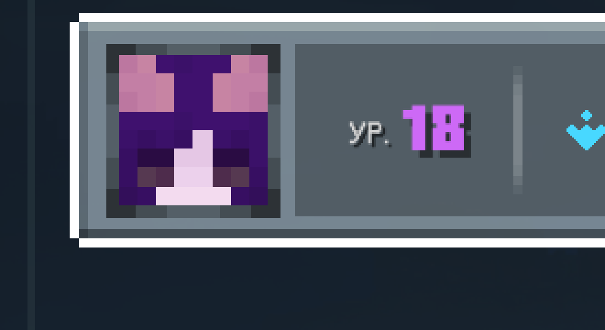
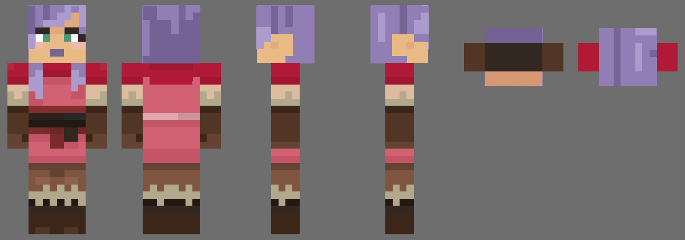
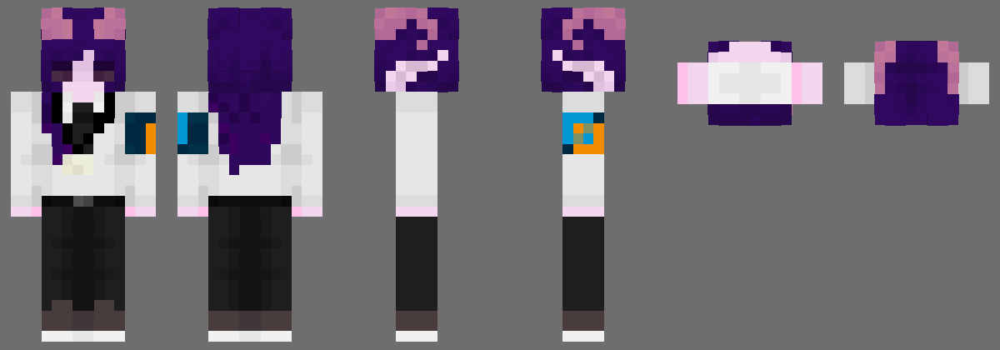
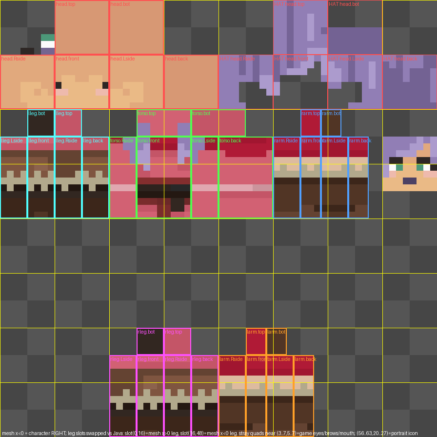

# dungeons2-skin-loader

[Русский](README.md) · **English**

A cosmetic loader that turns Minecraft Java skins (PNG 64×64 or 64×32, classic/slim) into hero textures for **Minecraft Dungeons II** (Steam, Unreal Engine 5.6, IoStore).
It builds one small pack `Dungeons-ZZZ_Skins_P.{pak,ucas,utoc}`; original game files are **never modified** — to revert, delete those three files.

> Personal use on your own copy of the game only. The repository contains **no game files and no AES key** — the tool extracts what it needs from *your* installation.
> Not affiliated with Mojang / Microsoft / Xbox Game Studios. Cosmetic only, not a cheat.



## Features
- Converts the Java skin layout (head, body, arms, legs, overlay/hat) to the game's atlas using the real mesh geometry (`SK_Player_Master`).
- Slim / classic arms are auto-detected.
- The hero portrait icon in the Heroes menu (8×8 texels at (56,20)) is rebuilt from the skin's face + hat; the position was verified with an in-game marker test.
- Download a skin by Mojang nickname (GUI).
- Capes (`--cape`, 32×16) — **untested**.
- Eyes: default mode is **`hide`** — the game's animated eyes/brows/mouth are hidden and the eyes painted on your skin are shown (static, no blinking). This is the verified mode. Other modes (`match`, `shift`, `auto`, `game`) are experimental, see [docs/EYES.md](docs/EYES.md).

## Slots
One skin = one hero slot: `Pink, Brown, Gray, Green, Mint, Plum, Purple, Silver, Yellow, Alex, Steve, Valorie, Violet, Darian, Eshe, Esperanza, Greta, Healer(+_Deluxe), Javier, Nuru, PizzaChef, Qamar, Ranger(+_Deluxe), Tank(+_Deluxe)` (`python skintool/build.py --list`).
The PNG file name is the slot (`Pink.png` replaces hero Pink). Other names → `config.json` (`{"map": {"my_skin.png": "Violet"}}`).

## Install (Windows)
1. Python 3.10+ (tick *Add python.exe to PATH*), then `pip install pillow numpy`.
2. **Extract data from your own game copy once** (needs the AES key, see below):
   ```
   python tools/extract_from_game.py --aes 0xYOUR_KEY
   ```
   It downloads [retoc](https://github.com/trumank/retoc) v0.1.5 (SHA-256 checked), unpacks `Player/Skins`, `Capes` and `SK_Player_Master` into `skintool/base/` and `skintool/mesh/`.
   Those are game data: git-ignored, do not publish them. If a skin pack is already installed in `Paks` the script stops: restore first (`skintool\restore.bat`), extract, then reinstall.
3. Put PNGs into `skintool/skins/` (or use `examples/skins/`), close the game and run:
   ```
   python skintool/build.py --skins examples/skins
   ```
   or `skintool\run.bat` (GUI with Install / Restore buttons).
4. Revert: `skintool\restore.bat`, or delete `Dungeons-ZZZ_Skins_P.*` from `...\Minecraft Dungeons II\Dungeons\Content\Paks`. After a game update rebuild the pack (re-run `extract_from_game.py`).

### Getting the AES key
The IoStore encryption key of your copy is **not distributed here**. Obtain it yourself (e.g. with the usual Unreal Engine key-finding tools against `Dungeons-Win64-Shipping.exe`, or from the Minecraft Dungeons II modding community).
The script accepts it via `--aes`, the `MD2_AES_KEY` environment variable or an interactive prompt; it is never stored or printed.

## Quick example
`examples/skins/` has four sample skins in slots Pink/Valorie/Violet/Alex and a `config.json` with `hide`. Author credits: [examples/README.md](examples/README.md).
```
python tools/extract_from_game.py --aes 0x...
python skintool/build.py --skins examples/skins
```
Build without installing: add `--no-install` (output goes to `skintool/skintool_data/out/`).

## CLI
`python skintool/build.py [--skins DIR] [--eyes hide|game|match|shift|auto] [--cape] [--no-install] [--paks PATH] [--restore] [--list]`

## Verified vs. not verified
Verified in game (Windows, Steam, UE5.6): texture replacement on four slots, slim arms, the hero icon in the menu, the back of the model, `hide` mode.
**Not verified**: GUI restore on a clean machine, `--cape`, 64×32 input, soles up close, classic (4 px) arms on every slot, the whole GUI, other game versions (mesh offsets in `extract_from_game.py` match the current build; the script validates the mesh and stops on mismatch). No prebuilt `.exe`.

## Screenshots
 
  
Back-view and per-slot before/after screenshots are not included (checked in game by the project owner, no captured frames).

## Docs
[docs/FORMAT.md](docs/FORMAT.md) · [docs/EYES.md](docs/EYES.md)

## License
Code and docs: [personal, non-commercial use, no distribution of game files](LICENSE). Skins in `examples/` belong to their authors.
