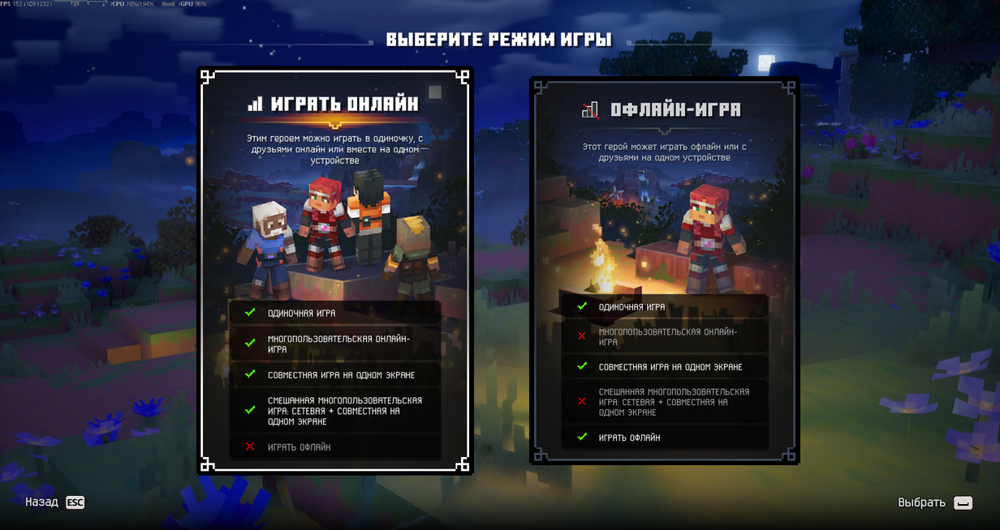
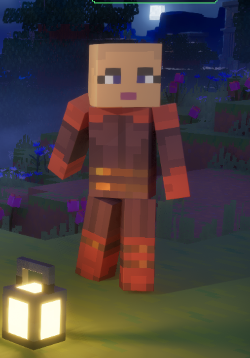
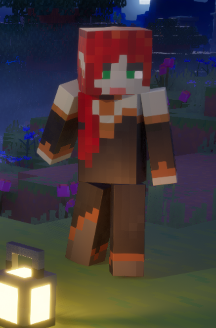
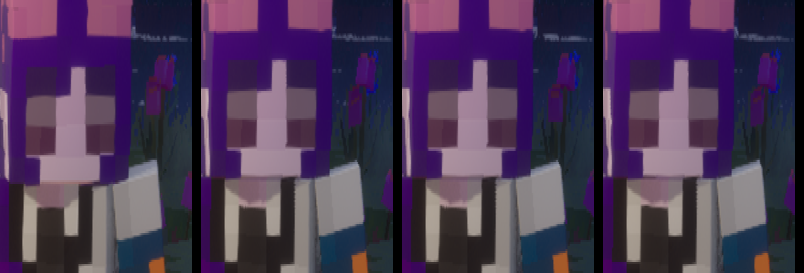

# dungeons2-skin-loader

**Язык: Русский** · [English](README.en.md)

Косметический загрузчик Java-скинов Minecraft (PNG 64×64 или 64×32, classic/slim) для **Minecraft Dungeons II** (Steam, Unreal Engine 5.6, IoStore).
Скин подменяет текстуру выбранного героя (слот = цвет/герой из списка игры). Собирается один небольшой пак `Dungeons-ZZZ_Skins_P.{pak,ucas,utoc}`,
оригинальные файлы игры **не изменяются**; откат — удалить три файла.

> Только для личного использования, на своей копии игры. Ни игровых файлов, ни AES-ключа в репозитории нет — инструмент достаёт нужное из **вашей** копии игры.
> Проект не связан с Mojang / Microsoft / Xbox Game Studios. Это не чит: меняется только внешний вид вашего героя.


## Что умеет
- Конвертирует раскладку Java-скина (голова, тело, руки, ноги, второй слой/шляпа) в атлас игры по реальной геометрии меша (`SK_Player_Master`).
- Тип рук (slim / classic) определяется автоматически по скину.
- Иконка героя в меню «Герои» (8×8 в атласе, позиция (56,20)) собирается из лица и шляпы скина; смещение проверено маркерным тестом в игре.
- Можно скачать скин по нику Mojang (в GUI).
- Плащи (`--cape`, 32×16) — **не тестировались**.
- Глаза: по умолчанию режим **`hide`** — игровые анимированные глаза/брови/рот скрыты, видны глаза, нарисованные на вашем скине (статичные, без моргания). Это проверенный режим. Остальные режимы (`match`, `shift`, `auto`, `game`) — экспериментальные, подробности в [docs/EYES.md](docs/EYES.md).

## Слоты
Один скин = один слот героя. Слоты: `Pink, Brown, Gray, Green, Mint, Plum, Purple, Silver, Yellow, Alex, Steve, Valorie, Violet, Darian, Eshe, Esperanza, Greta, Healer(+_Deluxe), Javier, Nuru, PizzaChef, Qamar, Ranger(+_Deluxe), Tank(+_Deluxe)` (`python skintool/build.py --list`).
Имя PNG в папке скинов = слот (`Pink.png` заменит героя Pink). Другое имя → `config.json` (`{"map": {"мой_скин.png": "Violet"}}`).

## Установка (Windows)
1. Python 3.10+ (галочка *Add python.exe to PATH*), затем `pip install pillow numpy`.
2. **Один раз извлеките данные из своей копии игры** (нужен AES-ключ, см. ниже):
   ```
   python tools/extract_from_game.py --aes 0xВАШ_КЛЮЧ
   ```
   Скрипт скачает [retoc](https://github.com/trumank/retoc) v0.1.5 (проверяет SHA-256), распакует `Player/Skins`, `Capes` и `SK_Player_Master` в `skintool/base/` и `skintool/mesh/`.
   Эти файлы — игровые данные: они в `.gitignore`, не публикуйте их. Если в `Paks` уже стоит пак скинов, скрипт остановится: сначала откатите (`skintool\restore.bat`), извлеките, потом ставьте скины заново.
3. Положите PNG в `skintool/skins/` (или используйте `examples/skins/`), закройте игру и запустите:
   ```
   python skintool/build.py --skins examples/skins
   ```
   или `skintool\run.bat` (окно с выбором скинов и кнопками «Поставить»/«Откатить»).
4. Откат: `skintool\restore.bat` или удалить `Dungeons-ZZZ_Skins_P.*` из `...\Minecraft Dungeons II\Dungeons\Content\Paks`. Если Steam обновит игру — пак может потребоваться пересобрать (`extract_from_game.py` заново).

### Как получить AES-ключ
Ключ шифрования IoStore-архивов вашей копии игры — не секрет авторов этого проекта и в репозитории **не распространяется**. Его можно получить самостоятельно, например,
извлечь из процесса игры/из исполняемого файла известными инструментами для UE (поиск ключа в `Dungeons-Win64-Shipping.exe`) или найти в сообществе моддеров Minecraft Dungeons II.
Скрипт принимает ключ через `--aes`, переменную окружения `MD2_AES_KEY` или интерактивно; ключ нигде не сохраняется и не печатается.

## Быстрый пример
`examples/skins/` — четыре примера в слотах Pink/Valorie/Violet/Alex, `config.json` с режимом `hide`. Атрибуция авторов: [examples/README.md](examples/README.md).
```
python tools/extract_from_game.py --aes 0x...
python skintool/build.py --skins examples/skins
```
Другие скины: `python skintool/build.py --skins examples/extra --no-install` (соберёт пак в `skintool/skintool_data/out/`, не устанавливая).

## Командная строка
`python skintool/build.py [--skins ПАПКА] [--eyes hide|game|match|shift|auto] [--cape] [--no-install] [--paks ПУТЬ] [--restore] [--list]`

## Скриншоты
| | |
|---|---|
|  | Меню «Герои» с итоговым паком (иконка героя и модель) |
|  | Экран выбора режима игры с другим слотом (Valorie = ModemIX) |
|  | Иконка героя крупно |
|   | Нативная раскладка атласа и наша (рендеры) |
|  | Раскладка атласа 64×64 → части меша |
|   | Игровая строка глаз (y=12) и скин со смещением на 1 px |
|  | Моргание игровых кусочков в режиме `match` (экспериментально) |

## Что проверено, а что нет
Проверено в игре (Windows, Steam, UE5.6): подмена текстур четырёх слотов, руки slim, иконка героя в меню, спина, режим `hide`.
**Не проверено**: `--restore` из GUI на чистой системе, `--cape`, вход 64×32, подошвы вблизи, классические (4 px) руки на всех слотах, GUI полностью, другие версии игры (смещения меша в `extract_from_game.py` привязаны к текущей версии; скрипт проверяет меш и останавливается, если он не совпал).
Нет готового `.exe`. Скриншоты вида сзади и «до/после» для каждого из 4 слотов в репозиторий не добавлены (в игре подтверждено владельцем проекта, кадров нет).

## Документация
[docs/FORMAT.md](docs/FORMAT.md) — формат и раскладка · [docs/EYES.md](docs/EYES.md) — глаза, кости, тексели · [GUIDE_RU.md](GUIDE_RU.md) — короткий гайд для друзей.

## Лицензия
Код и документация — [личное использование](LICENSE) (не коммерческое, без распространения игровых файлов). Скины в `examples/` принадлежат их авторам.
